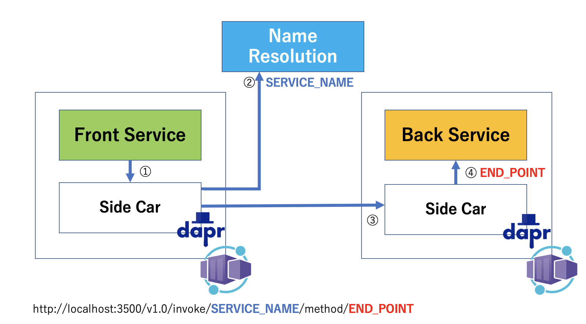

# Azure Container Apps で Dapr を利用した Service 間呼び出し




## Back Service の Java プロジェクトの作成

まず、呼び出される側のバックエンドのサービスを作成します。

```bash
mvn io.quarkus.platform:quarkus-maven-plugin:2.8.2.Final:create \
    -DprojectGroupId=com.yoshio3 \
    -DprojectVersion=1.0.0-SNAPSHOT \
    -DclassName=com.yoshio3.Main \
    -Dpath="/hello" \
    -Dextensions="resteasy,resteasy-jackson" \
    -DprojectArtifactId=back-service
```

今回作成するサービスは、サービス呼び出しの検証を簡単にするため、簡単な JSON の文字列を返すサービスを作成します。
`Main.java` ファイルの内容を下記のように書き換えてください。これにより、`/hello-service` のエンドポイントにアクセスした場合、`BackData.java` で定義する JSON 形式の文字列が返るようになります。

```java
package com.yoshio3;

import javax.ws.rs.GET;
import javax.ws.rs.Path;
import javax.ws.rs.Produces;
import javax.ws.rs.core.MediaType;

@Path("/")
public class Main {

    @GET
    @Path("/hello-service")
    @Produces(MediaType.APPLICATION_JSON)
    public BackData hello() {
        BackData data = new BackData("back result","This is Backend Service");
        return data;
    }
}
```

次に、JSON のデータ・モデルを定義します。

```java
package com.yoshio3;

public class BackData {

    public String message;
    public String description;

    public BackData(){        
    }

    public BackData(String message, String description){
        this.message = message;
        this.description = description;
    }
}
```

上記の `BackData.java` の定義により下記のような JSON の文字列が返るようになります。

```json
{"message":"back result","description":"This is Backend Service"}
```

ソースコードの修正が終わったのち、ローカルで動作確認を行います。下記の `mvn quarkus:dev` コマンドを実行してください。

```bash
mvn quarkus:dev
```

サービスが起動したのち、ブラウザもしくは `curl` コマンドなどでエンドポイントにアクセスし実装した文字列が返される事を確認してください。

```bash
curl localhost:8080/hello-service
{"message":"back result","description":"This is Backend Service"}
```

### Back Service 用コンテナの作成

Java のプロジェクトを作成したので、次にコンテナ化します。
今回作成するサービスは、Java のクラスファイルから実行するのではなく、Linux ネィティブ・バイナリを作成し、それを実行するようにします。Java のクラスから Linux のネィティブ・バイナリを作成するために [BUILDING A NATIVE EXECUTABLE](https://quarkus.io/guides/building-native-image) に記載されている [マルチ・ステージ Docker build](https://quarkus.io/guides/building-native-image#multistage-docker) の Dockerfile を利用します。

```dockerfile
## Stage 1 : build with maven builder image with native capabi lities
FROM quay.io/quarkus/ubi-quarkus-native-image:21.3.1-java11 AS build

COPY --chown=quarkus:quarkus mvnw /code/mvnw
COPY --chown=quarkus:quarkus .mvn /code/.mvn
COPY --chown=quarkus:quarkus pom.xml /code/
USER quarkus
WORKDIR /code

RUN ./mvnw -B org.apache.maven.plugins:maven-dependency-plugin:3.1.2:go-offline
COPY src /code/src
RUN ./mvnw package -Pnative -DskipTests

## Stage 2 : create the docker final image
FROM quay.io/quarkus/quarkus-micro-image:1.0
WORKDIR /work/
COPY --from=build /code/target/*-runner /work/application

## Set TimeZone
RUN ln -sf /usr/share/zoneinfo/Asia/Tokyo /etc/localtime
ENV TZ=Asia/Tokyo

# set up permissions for user `1001`
RUN chmod 775 /work /work/application \
  && chown -R 1001 /work \
  && chmod -R "g+rwX" /work \
  && chown -R 1001:root /work

EXPOSE 8080
USER 1001

CMD ["./application", "-Dquarkus.http.host=0.0.0.0"]
```

> 注意：  
> 上記の Dockerfile には１点、下記の追記箇所がありますのでご注意ください。
> Quarkus のコンテナ・イメージ ([quarkus-micro-image](https://quarkus.io/guides/quarkus-runtime-base-image)) は Red Hat の [Universal Base Image](https://hub.docker.com/r/redhat/ubi8#!) がベースになっています。タイムゾーンを変更するためには、下記の追加が必要です。出力されたログを確認する際に日本時間でログが確認できるようになるため追加しておきます。

```text
## Set TimeZone
RUN ln -sf /usr/share/zoneinfo/Asia/Tokyo /etc/localtime
ENV TZ=Asia/Tokyo
```

`Dockerfile` を作成した後、コンテナをビルドし、コンテナ・レジストリにイメージをプッシュします。

```bash
rm .dockerignore
docker build -f Dockerfile -t tyoshio2002/back-service:1.0 .
docker tag tyoshio2002/back-service:1.0 yoshio.azurecr.io/tyoshio2002/back-service:1.0
docker push yoshio.azurecr.io/tyoshio2002/back-service:1.0
```

> 注意：  
> コンテナをビルドするために、`.dockerignore` ファイルが存在している場合、ファイルのコピーに失敗します。そこで今回はこのファイルを削除します。

Azure Container Registry に `back-service` が追加されているか否か確認します。

```azurecli
az acr repository show -n $YOUR_CONTAINER_REGISTRY_NAME --image tyoshio2002/back-service:1.0
```

実行すると下記のような結果が表示されます。

```text
{
  "changeableAttributes": {
    "deleteEnabled": true,
    "listEnabled": true,
    "readEnabled": true,
    "writeEnabled": true
  },
  "createdTime": "2022-04-25T02:21:42.4321004Z",
  "digest": "sha256:0564725591c905731b7f44f226610d1b7496aa755fb111c62f0e15cb950e9d97",
  "lastUpdateTime": "2022-04-25T02:21:42.4321004Z",
  "name": "1.0",
  "quarantineState": "Passed",
  "signed": false
}
```

### Back Service を Dapr 対応にし Azure Container Apps にデプロイ

コンテナのイメージを作成しレジストリに登録したので、Dapr 対応のアプリケーションとしてAzure Container Apps にインスタンスを作成します。
今回作成する Azure Container Apps `のリソース・グループ`と`コンテナ環境`を環境変数に設定します。

```bash
export RESOURCE_GROUP="joad-container-apps"
export CONTAINERAPPS_ENVIRONMENT="joad-env"
```

> ご注意:  
> Azure Container Apps を作成するために必要なログ・アナリティクスの構築方法やコンテナ環境の作成に関する詳細は[こちら](http://localhost)をご覧ください。

`az containerapp create` コマンドを実行し、Azure Container Apps のインスタンスを作成してください。

```azurecli
az containerapp create \
  --name back-service \
  --resource-group $RESOURCE_GROUP \
  --environment $CONTAINERAPPS_ENVIRONMENT \
  --image yoshio.azurecr.io/tyoshio2002/back-service:1.0 \
  --target-port 8080 \
  --ingress 'external' \
  --query 'configuration.ingress.fqdn' \
  --cpu 1 --memory 2.0Gi \
  --min-replicas 1 --max-replicas 4 \
  --enable-dapr \
  --dapr-app-port 8080 \
  --dapr-app-id back-service 
```

完了すると下記のように、外部から接続するための URL が表示されます。

```text
Command group 'containerapp' is in preview and under development. Reference and support levels: https://aka.ms/CLI_refstatus
\ Running ..
Container app created. Access your app at https://back-service.blacksea-5e5974d3.eastus.azurecontainerapps.io/
```

ブラウザ、もしくは curl コマンドを利用して接続用の URL に RESTful エンドポイント (`hello-service`) を付加してアクセスします。

```bash
curl https://back-service.blacksea-5e5974d3.eastus.azurecontainerapps.io/hello-service
```

正しく動いている場合 `{"message":"back result","description":"This is Backend Service"}` の JSON 文字列が表示されます。

### ビルド・スクリプトの作成

ソースコード変更など、次回以降ローカルからの更新を簡単にするために、シェル・スクリプトを作成します。これにより、例えば `./build.sh 1.0` を実行すると、Container Apps まで自動的に更新できるようになります。

実行例：

```bash
./build.sh 
./build.sh [version-number]
```

`build.sh` ファイルを作成し下記を記述してください。

```bash
#!/bin/bash
set -e

if [ "$1" = "" ]
then
    echo "./build.sh [version-number]"
    exit 1
fi
export VERSION=$1

# Config Parameter (Need Change This Value !!) 
###################################
APPLICATION_NAME="back-service"
RESOURCE_GROUP="joad-container-apps"
CONTAINERAPPS_ENVIRONMENT="joad-env"

DOCKER_IMAGE=tyoshio2002/$APPLICATION_NAME
DOCKER_REPOSITORY=yoshio.azurecr.io
###################################

###################################
# Build docker image
docker build -t $DOCKER_IMAGE:$VERSION . -f Dockerfile
docker tag $DOCKER_IMAGE:$VERSION $DOCKER_REPOSITORY/$DOCKER_IMAGE:$VERSION
# Push the image to Private Docker Registry
docker push $DOCKER_REPOSITORY/$DOCKER_IMAGE:$VERSION

###################################
# Update Azure Container Apps Instance
az containerapp update \
 --name $APPLICATION_NAME \
 --resource-group $RESOURCE_GROUP \
 --image $DOCKER_REPOSITORY/$DOCKER_IMAGE:$VERSION
```


## Front Service の作成

続いて、`Front Service` を実装します。下記のコマンドを実行し、プロジェクトを作成してください。

> 注意:  
> `Back Service` を HTTP で呼び出すために RESTClient の Extension ライブラリを追加しています。

```bash
mvn io.quarkus.platform:quarkus-maven-plugin:2.8.2.Final:create \
    -DprojectGroupId=com.yoshio3 \
    -DprojectVersion=1.0.0-SNAPSHOT \
    -DclassName=com.yoshio3.Main \
    -Dpath="/svc" \
    -Dextensions="resteasy,resteasy-jackson,rest-client,rest-client-jackson" \
    -DprojectArtifactId=front-service
```

プロジェクトを作成すると `MyRemoteService.java` というファイルが自動生成され、RESTClient のサンプル・コードが実装されています。このファイルを下記のように編集してください。

```java
package com.yoshio3;

import org.eclipse.microprofile.rest.client.annotation.RegisterProvider;
import org.eclipse.microprofile.rest.client.inject.RegisterRestClient;
import javax.ws.rs.Consumes;
import javax.ws.rs.GET;
import javax.ws.rs.Path;
import javax.ws.rs.Produces;
import javax.ws.rs.core.MediaType;

@RegisterRestClient(baseUri = "http://localhost:3500/v1.0")
@RegisterProvider(RestClientRequestFilter.class)
public interface MyRemoteService {

    @GET
    @Path("/invoke/back-service/method/hello-service")
    @Produces(MediaType.APPLICATION_JSON)
    @Consumes(MediaType.APPLICATION_JSON)
    public BackData invokeBackService();    

}
```

上記の RESTClient の実装を行うことで、下記の URL エンドポイントにアクセスし、Dapr 経由で `back-service` の `hello-service` メソッドを呼び出します。`back-service` は Azure Container Apps のインスタンス作成時に指定した名前です。

`http://localhost:3500/v1.0/invoke/back-service/method/hello-service`

上記 `MyRemoteService.java` の実装中で `@RegisterProvider` アノテーションを付加し、リクエストやレスポンスをインターセプトするクラス`RestClientRequestFilter.class` を指定しています。これにより、正しくリクエストやレスポンスが正しく生成されているかを確認するなど、追加処理を行うことが可能です。必要に応じて実装してください。

```java
package com.yoshio3;

import java.io.IOException;
import javax.ws.rs.client.ClientRequestContext;
import javax.ws.rs.client.ClientRequestFilter;
import javax.ws.rs.client.ClientResponseContext;
import javax.ws.rs.client.ClientResponseFilter;
import org.jboss.logging.Logger;

public class RestClientRequestFilter implements ClientRequestFilter, ClientResponseFilter{

    private static final Logger LOG = Logger.getLogger(RestClientRequestFilter.class);    
    @Override
    public void filter(ClientRequestContext requestContext) throws IOException {
        LOG.debug("-------- REQUEST URL -----" + requestContext.getUri().toString());
        requestContext.getHeaders().forEach((key, value) -> value.stream()
                .map(k -> (String)k)
                .forEach(v -> {LOG.debug("REQUEST HEADER NAME: " + key + "\t HEADER VALUE: " + v);}));
    }

    @Override
    public void filter(ClientRequestContext requestContext, ClientResponseContext responseContext) throws IOException {
        LOG.debug("----- Media Type --- " + responseContext.getMediaType().toString());
        LOG.debug("----- Status Code --- " +responseContext.getStatus());
        responseContext.getHeaders().forEach((key, value) -> value.stream()
            .map(k -> (String)k)
            .forEach(v -> {LOG.debug("RESPONSE HEADER NAME: " + key + "\t HEADER VALUE: " + v);}));
    }
}
```

次に、上記の RESTClient を呼び出すコードを `Main.java` クラス内に実装します。

```java
package com.yoshio3;

import javax.inject.Inject;
import javax.ws.rs.Consumes;
import javax.ws.rs.GET;
import javax.ws.rs.Path;
import javax.ws.rs.Produces;
import javax.ws.rs.core.MediaType;

import org.eclipse.microprofile.rest.client.inject.RestClient;

@Path("/")
public class Main {

    @Inject
    @RestClient
    MyRemoteService remoteSvc;

    @GET
    @Produces(MediaType.APPLICATION_JSON)
    @Consumes(MediaType.APPLICATION_JSON)
    @Path("/serviceB")
    public BackData invokeBackService() {
        return remoteSvc.invokeBackService();
    }
}
```

`@Inject` と `@RestClient` のアノテーションで、`MyRemoteService` のインスタンスに依存関係を注入しています。

さらに RESTful エンドポイントを１つ実装し (`/serviceB`)、外部から呼び出された場合に、`MyRemoteService` の `invokeBackService()` を呼び出しています。今回は、`Back Service` から返ってきた JSON の文字列をそのままレスポンスとして返すため、`BackData.java` を定義し、`invokeBackService()` メソッドの返り値として使用します。

```java
package com.yoshio3;

public class BackData {

    public String message;
    public String description;

    public BackData(){        
    }

    public BackData(String message, String description){
        this.message = message;
        this.description = description;
    }
}
```

これにより、Front Service の `/serviceB` のエンドポイントにアクセスすると、`Back Service` で生成された JSON の文字列がそのまま返ってくるようになります。

```bash
 curl https://front-service.********.azurecontainerapps.io/serviceB
{"message":"back result","description":"This is Backend Service"}
```

### Front Service 用 コンテナ・イメージと Azure Container Apps インスタンスの作成

下記を実行し、Front Service 用のコンテナ・イメージを作成し、最後に Azure Container Apps のインスタンスを作成してください。

```bash
VERSION=1.0

APPLICATION_NAME="front-service2"
RESOURCE_GROUP="joad-container-apps"
CONTAINERAPPS_ENVIRONMENT="joad-env"

DOCKER_IMAGE=tyoshio2002/$APPLICATION_NAME
DOCKER_REPOSITORY=yoshio.azurecr.io

# Build docker image
docker build -t $DOCKER_IMAGE:$VERSION . -f Dockerfile
docker tag $DOCKER_IMAGE:$VERSION $DOCKER_REPOSITORY/$DOCKER_IMAGE:$VERSION

# Push the image to Private Docker Registry
docker push $DOCKER_REPOSITORY/$DOCKER_IMAGE:$VERSION

# Create Azure Container Apps Instance
az containerapp create \
  --name $APPLICATION_NAME \
  --resource-group  $RESOURCE_GROUP\
  --environment $CONTAINERAPPS_ENVIRONMENT \
  --image  $DOCKER_REPOSITORY/$DOCKER_IMAGE:$VERSION\
  --target-port 8080 \
  --ingress 'external' \
  --query 'configuration.ingress.fqdn' \
  --cpu 1 --memory 2.0Gi \
  --min-replicas 1 --max-replicas 4 \
  --enable-dapr \
  --dapr-app-port 8080 \
  --dapr-app-id $APPLICATION_NAME
```

実行に成功すると、下記のように外部からの接続用 URL が表示されます。

```text
Command group 'containerapp' is in preview and under development. Reference and support levels: https://aka.ms/CLI_refstatus
/ Running ..
Container app created. 
Access your app at https://front-service.blacksea-5e5974d3.eastus.azurecontainerapps.io/
```

上記の URL に対して `/serviceB` のエンドポイントを付加して、curl コマンドもしくはブラウザでアクセスをしてください。すると下記のような結果が得られます。

```bash
curl -v https://front-service.blacksea-5e5974d3.eastus.azurecontainerapps.io/serviceB

* Using HTTP2, server supports multiplexing
* Connection state changed (HTTP/2 confirmed)
* Copying HTTP/2 data in stream buffer to connection buffer after upgrade: len=0
* Using Stream ID: 1 (easy handle 0x7fa0a400ca00)
> GET /serviceB HTTP/2
> Host: front-service.blacksea-5e5974d3.eastus.azurecontainerapps.io
> user-agent: curl/7.79.1
> accept: */*
> 
< HTTP/2 200 
< content-type: application/json
< content-length: 65
< date: Wed, 27 Apr 2022 16:32:08 GMT
< 
* Connection #0 to host front-service.blacksea-5e5974d3.eastus.azurecontainerapps.io left intact
{"message":"back result","description":"This is Backend Service"}
```
## まとめ

上記に示したように、`Front Service` から `Back Service` に対してサービスを呼び出しできるようになりました。 Dapr のサイドカーを経由し、 Dapr が内部的に名前解決をしてくれるため、バックエンドのサービスが複数インスタンス稼働している場合でも、内部的に名前解決をし適切にリクエストを送信してくれるようになります。つまりマイクロサービスの開発・運用においてサービス管理がより容易になります。それ以外にも、アクセス可能なサービスを制限したりできるようになるため、より簡単にセキュアなサービス間連携が可能になります。
ぜひ、Dapr を統合した Azure Container Apps をお試しください。
